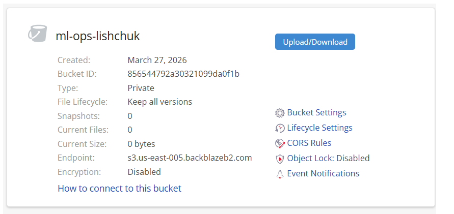
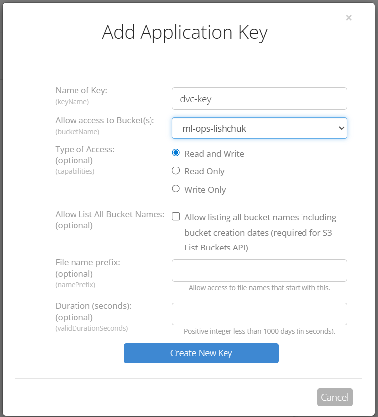
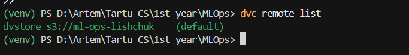

# Practice 3 Report

**GitHub Repository:** https://github.com/Artem-Lishchuk/MLOps  
**Remote Storage:** Backblaze B2 (S3-compatible)

## 1. Remote Storage Setup (Backblaze B2)

A new private bucket named `ml-ops-lishchuk` was created in Backblaze B2. The bucket is configured to keep all versions of files, providing a robust history for DVC-tracked data.

**Bucket Details:**
- **Name:** `ml-ops-lishchuk`
- **Endpoint:** `s3.us-east-005.backblazeb2.com`
- **Type:** Private



To allow DVC to communicate with the bucket, an **Application Key** was generated with appropriate read/write permissions.



---

## 2. DVC Configuration

The DVC remote was updated to use the S3-compatible API provided by Backblaze.

### Terminal Commands:

```powershell
# Set the S3 endpoint URL for Backblaze
dvc remote modify dvstore endpointurl https://s3.us-east-005.backblazeb2.com

# Configure credentials locally (not committed to Git)
dvc remote modify dvstore access_key_id 'KEY_ID' --local
dvc remote modify dvstore secret_access_key 'KEY' --local
```

### Configuration Verification:

The `dvc remote list` command confirms that `dvstore` is now the default remote pointing to the S3 bucket.



---

## 3. Pipeline Implementation

The classification model workflow was refactored from a Jupyter notebook used for HW2 into a modular DVC pipeline. The pipeline consists of four stages, each with clearly defined dependencies and outputs.

### Pipeline Structure:

- **`data_ingestion`**: Loads raw parquet files from the repository root, applies preprocessing (filtering, feature extraction, outlier removal), and saves an interim combined dataset.
- **`feature_engineering`**: Splits the interim data into training, validation, and test sets based on parameters.
- **`model_building`**: Trains a `RandomForestClassifier` using hyperparameters defined in `params.yaml`.
- **`evaluation`**: Evaluates the trained model on the test set and generates a metrics report.

### Parameterization (`params.yaml`):

All tunable aspects of the pipeline are centralized in `params.yaml`, including data paths, split ratios, feature columns, and model hyperparameters.

---

## 4. Pipeline Execution and Results

The pipeline is executed using the `dvc repro` command, which ensures that stages are only re-run if their dependencies or parameters have changed.

### Execution Summary:

```powershell
dvc repro
```

DVC successfully tracked the dependencies and skipped cached stages when no changes were detected.

### Model Evaluation:

The final model was evaluated on the test dataset (February 2021 data). The results are stored in `reports/metrics.json`.

**Test Metrics:**
- **F1-score:** 0.6278
- **Accuracy:** 0.5649
- **Precision:** 0.5349
- **Recall:** 0.7596

**Confusion Matrix:**
| | Predicted: 0 | Predicted: 1 |
|---|---|---|
| **Actual: 0** | 2117 | 3410 |
| **Actual: 1** | 1241 | 3922 |
