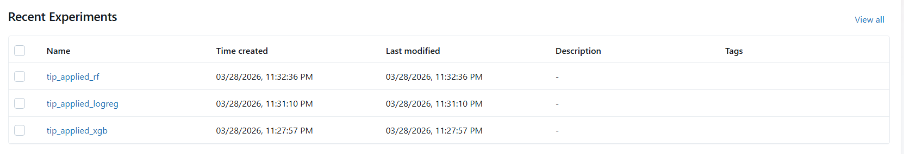
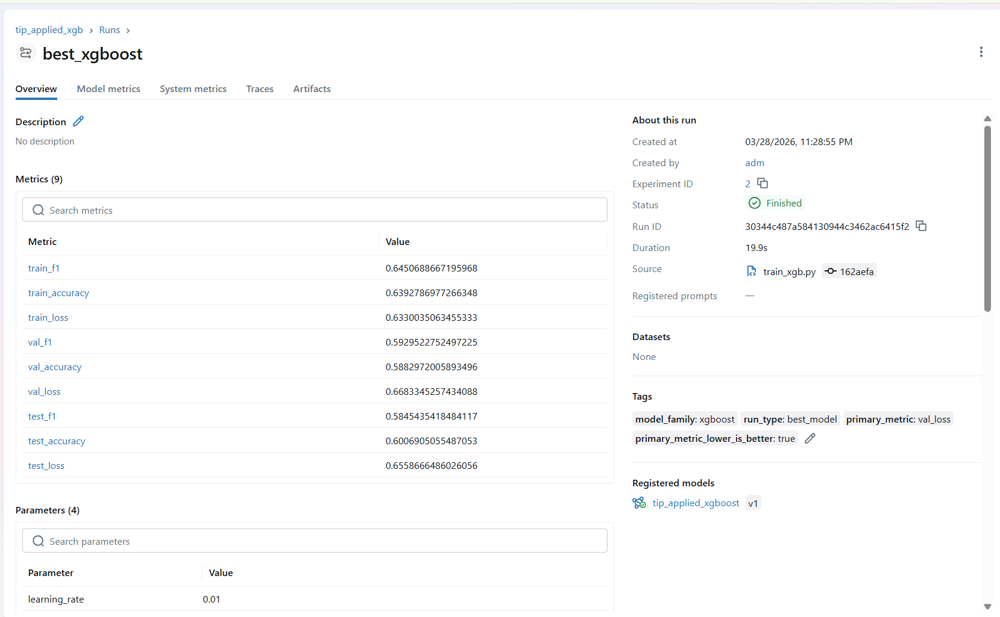
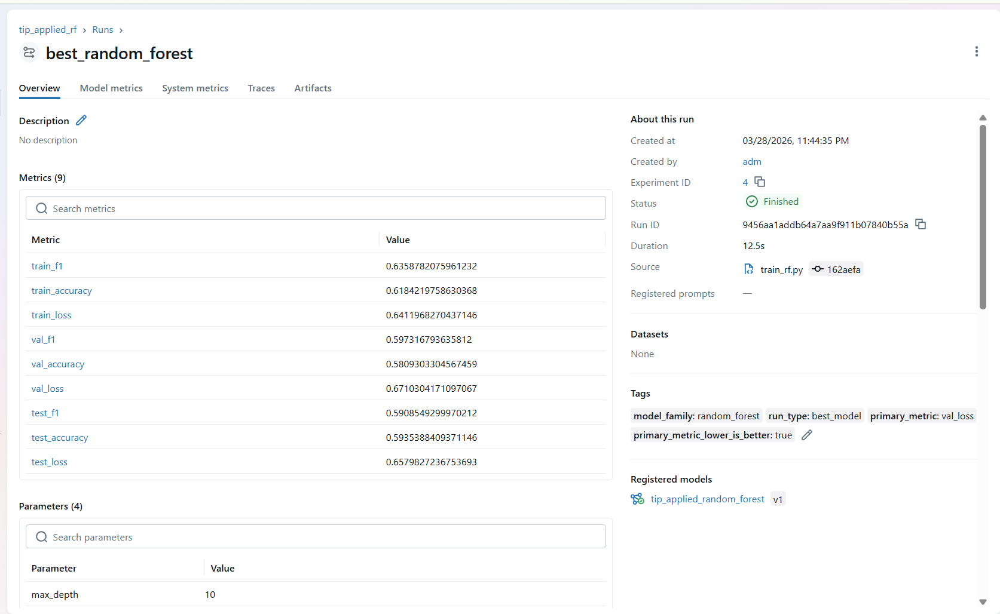
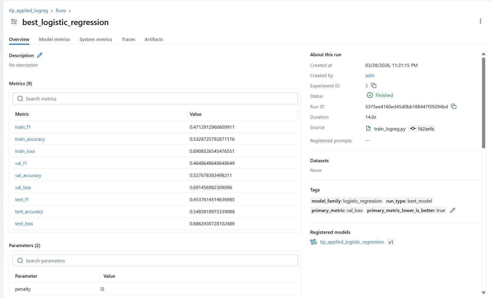
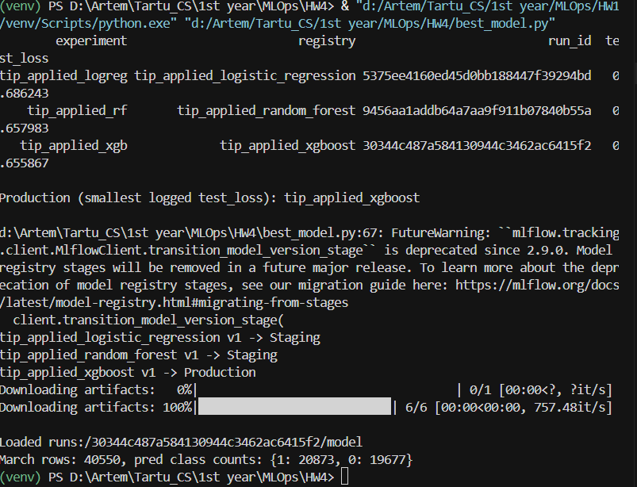

# Practice 4 Report – Experiment Tracking and Model Management with MLflow

**GitHub Repository:** https://github.com/Artem-Lishchuk/MLOps  

## 1. Experiment Setup and Hyperparameter Tuning

For this practice, three different regression models (Logistic Regression, Random Forest, and XGBoost) were trained to predict the `tip_applied` target. The training data consisted of the combined January and February 2021 Green Taxi datasets.

Each model was organized into its own MLflow experiment, and a hyperparameter search was performed using `ParameterGrid`.

### Experiments Overview:

- **`tip_applied_logreg`**: Logistic Regression with varying regularization strength `C`.
- **`tip_applied_rf`**: Random Forest Classifier with tuning for `n_estimators`, `max_depth`, and `max_features`.
- **`tip_applied_xgb`**: XGBoost Classifier with tuning for `learning_rate`, `max_depth`, and `subsample`.

The MLflow UI provides a clear overview of the experiments and the various runs within each.



### Training Process:

The training scripts (`train_logreg.py`, `train_rf.py`, `train_xgb.py`) follow a consistent pattern:
1. Load and process January and February data.
2. Split data into training and validation sets (80/20).
3. Iterate through hyperparameters, logging metrics (F1, Accuracy, Log Loss) for each run.
4. Identify the best run based on `val_loss` and log it as a separate "best model" run with the model artifact.
5. Register the best model in the MLflow Model Registry.

---

## 2. Model Evaluation and Registry Management

After training, the best versions of each model were evaluated on the **March 2021 holdout dataset**. This step ensures that the models generalize well to unseen data from a different month.

### Best Runs Details:

Below are the details for the best runs of each model family as captured in the MLflow UI. These runs were selected based on the lowest validation loss during the hyperparameter search.

#### XGBoost (Best Overall)
The XGBoost model achieved the best performance on the March test set. The screenshot shows the parameters and metrics for the `best_xgboost` run.



#### Random Forest
The Random Forest model also performed well, with a slightly higher test loss than XGBoost.



#### Logistic Regression
Logistic Regression served as a baseline, showing higher loss and lower F1-score compared to the ensemble methods.



### March 2021 Performance Summary:

| Model Family | Best Params | Test Loss (March) | Test F1 (March) |
|--------------|-------------|-------------------|-----------------|
| **XGBoost** | `lr=0.01, depth=10, n_est=300` | **0.655867** | 0.5845 |
| **Random Forest** | `depth=10, n_est=300, split=5` | 0.657983 | 0.5909 |
| **Logistic Regression** | `C=0.001, penalty=l2` | 0.686243 | 0.4538 |

### Automated Stage Assignment:

The script `best_model.py` was used to programmatically compare the models on the March dataset and assign registry stages. Based on the `test_loss` on March data, the XGBoost model was promoted to **Production**, while the others were set to **Staging**.

tip_applied_logistic_regression v1 -> Staging
tip_applied_random_forest v1 -> Staging
tip_applied_xgboost v1 -> Production
```

The Model Registry in MLflow tracks these versions and their assigned stages, providing a centralized location for model management.



---

## 3. Reproduction and Verification

To verify the integrity of the MLflow tracking and registry system, the Production model was reloaded and compared against its original training run.

### Verification Steps:
1. **Load Model**: The model was loaded using both its Run URI (`runs:/<id>/model`) and its Registry URI (`models:/tip_applied_xgboost/Production`).
2. **Inference**: Inference was rerun on the March 2021 test set.
3. **Comparison**: Predictions and metrics were compared.

### Results:
- **Predictions Identical:** `True`
- **Metrics Match:** All recomputed metrics (F1, Accuracy, Loss) matched the logged values in MLflow exactly.

**Explanation:**
The results match exactly because MLflow preserves the exact model artifact and environment metadata. Loading the model via the registry URI points to the same underlying artifact as the run URI, ensuring consistent behavior across different environments or deployment stages.
